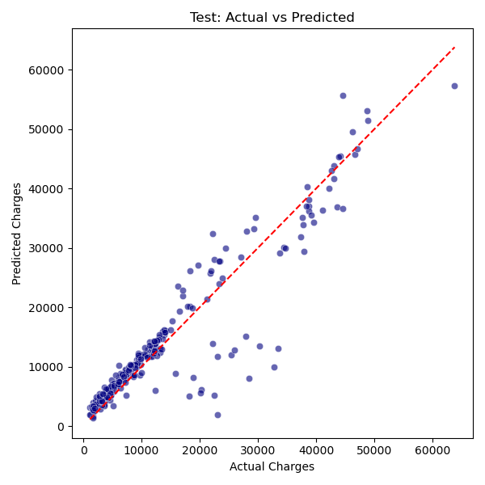

# توقع تكلفة التأمين الطبي

يحتوي هذا المشروع على مسارين مختلفين لتعلم الآلة لتوقع تكاليف التأمين الطبي باستخدام خصائص ديموغرافية وصحية.

## هيكل المشروع

| نوع النموذج                                                            | الوصف                                                                                                |
| ---------------------------------------------------------------------- | ---------------------------------------------------------------------------------------------------- |
| [النموذج الخطي](./model_linear_scaling)                                | نموذج الانحدار الخطي الأساسي مع الترميز بالتجزئة (One-hot encoding) وقياس الخصائص (Feature scaling)  |
| [نموذج الانحدار متعدد الحدود مع تنظيم Ridge](./model_polynomial_ridge) | نموذج متقدم يستخدم خصائص متعددة الحدود مع تنظيم Ridge وضبط المعاملات الفائقة (Hyperparameter tuning) |

## مجموعة البيانات

* `insurance.csv` — مجموعة بيانات حقيقية مأخوذة من [Kaggle](https://www.kaggle.com/datasets/mirichoi0218/insurance)

## الأدوات والمكتبات

* Python, Pandas, Scikit-learn, Seaborn, Matplotlib

## ✅ الهدف

مقارنة عدة نماذج انحدار وتقييم أدائها التنبؤي على بيانات تكاليف التأمين.

---

تم التطوير بواسطة [مهدي أبو علي](https://github.com/MahdiAbuAli1)

#  Medical Insurance Cost Prediction

This project contains two different machine learning pipelines to predict medical insurance costs using demographic and health-related features.

##  Project Structure

| Model Type | Description |
|------------|-------------|
| [ Linear Model](./model_linear_scaling) | Basic Linear Regression with one-hot encoding and feature scaling |
| [ Polynomial Ridge Model](./model_polynomial_ridge) | Advanced regression using polynomial features and Ridge regularization with hyperparameter tuning |

##  Dataset
- `insurance.csv` — real-world dataset from [Kaggle](https://www.kaggle.com/datasets/mirichoi0218/insurance)

##  Tools & Libraries
- Python, Pandas, Scikit-learn, Seaborn, Matplotlib

## ✅ Goal
Compare multiple regression models and evaluate their predictive performance on insurance cost data.

---

 Developed by [Mahdi Abu Ali](https://github.com/MahdiAbuAli1)

###  Sample Prediction Result

